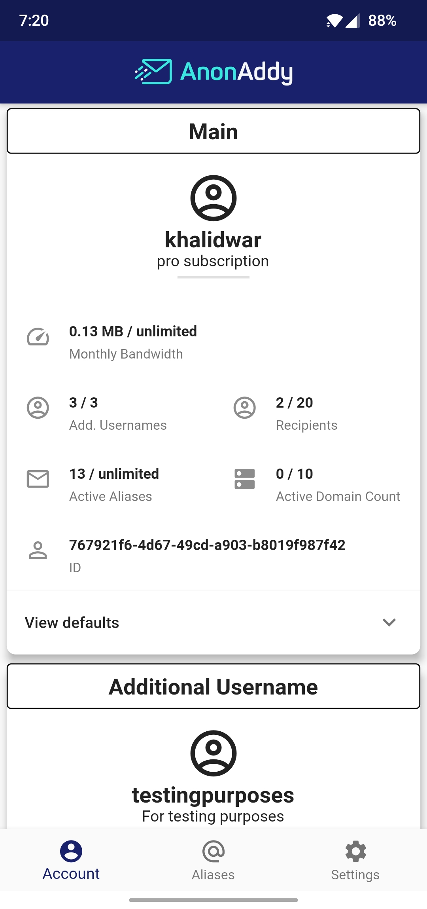
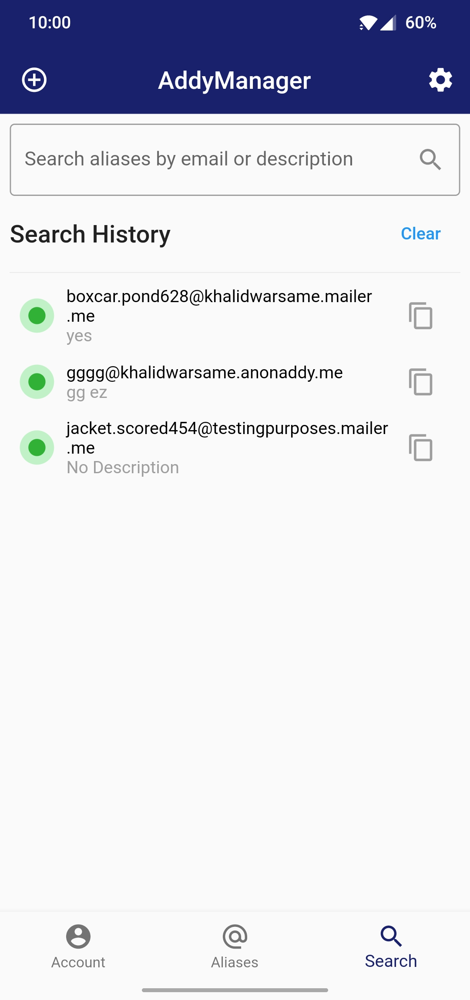
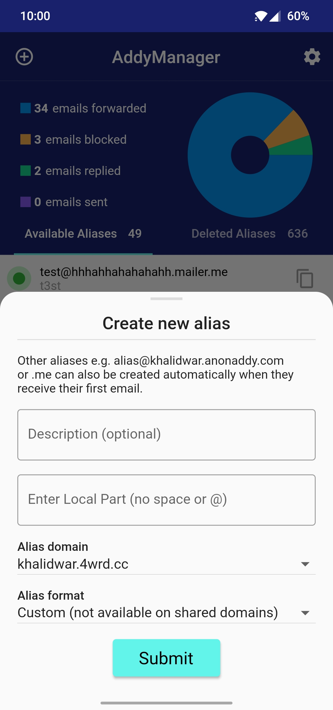
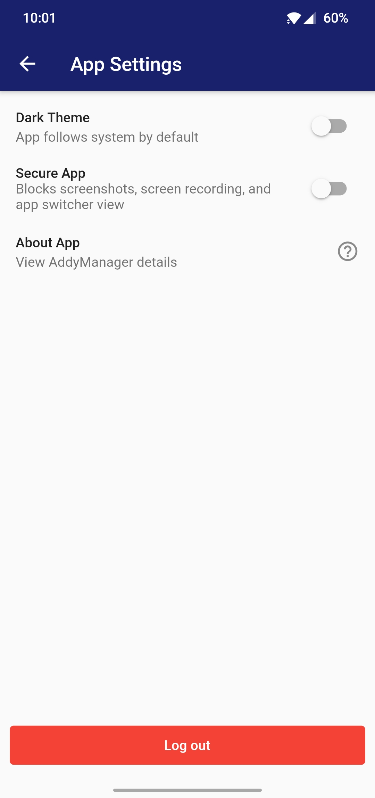
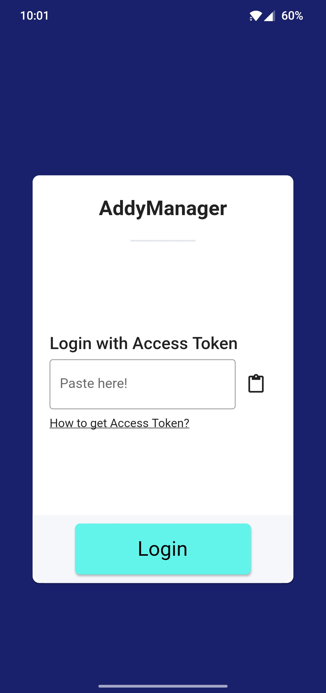

# AddyManager - AnonAddy for Android and iPhone.
Mobile app for [AnonAddy](https://anonaddy.com/). This app utilises [AnonAddy's API](https://app.anonaddy.com/docs/) to interact with user account.

## Get it on
  

## Support AddyManager
Your support will help the continuous development of this project. Click on QR codes to get copy-able wallet address.

  

## Screenshots
   
  

## Features
- Get detailed view of all aliases (available or deleted).
- Copy email address with a single tap. 
- Search aliases by email address, domain, alias, or description.
- Activate and deactivate aliases on the fly.
- Create new alias with custom description, domain, and format (UUID and random words).
- Delete and restore aliases.
- Add or remove PGP key.
- Enable or disable PGP Email encryption.
- Adaptive and persistive Light and Dark themes.
- Offline support: access your data even if you're in an airplane.

## Security
AddyManager requires [Access Token](https://app.anonaddy.com/settings) to access and manage your AnonAddy account. It utilizes secure storage, [Keychain](https://developer.apple.com/documentation/security/keychain_services#//apple_ref/doc/uid/TP30000897-CH203-TP1) for iOS and [KeyStore](https://developer.android.com/training/articles/keystore) for Android, to safely and securely store provided access token. 

Your access token is NOT sent to us or any third party server. However, access token is required to interact with your AnonAddy account and is used to fetch aliases, recipients, domains...etc.

## Privacy
AddyManager is free and open source software licensed under [MIT](https://github.com/KhalidWar/anonaddy/blob/master/LICENSE). Free as in free of charge, ads, analytics, and trackers. What's yours is yours.

Your account data, aliases, recipients, domains, search history...etc. do NOT leave your device and are DELETED upon log out. Again, what's yours is yours.

## Packages used
- [HTTP](https://pub.dev/packages/http)
- [Flutter Riverpod](https://pub.dev/packages/flutter_riverpod)
- [Shared Preference](https://pub.dev/packages/shared_preferences)
- [Flutter SVG](https://pub.dev/packages/flutter_svg)
- [Font Awesome Flutter](https://pub.dev/packages/font_awesome_flutter)
- [URL Launcher](https://pub.dev/packages/url_launcher)
- [Lottie](https://pub.dev/packages/lottie)
- [Flutter Secure Storage](https://pub.dev/packages/flutter_secure_storage)
- [FlutterToast](https://pub.dev/packages/fluttertoast)
- [Animations](https://pub.dev/packages/animations)
- [Mockito](https://pub.dev/packages/mockito)
- [Shimmer](https://pub.dev/packages/shimmer)
- [FL Chart](https://pub.dev/packages/fl_chart)
- [Connectivity](https://pub.dev/packages/connectivity)
- [Secure Application](https://pub.dev/packages/secure_application)
- [Local Auth](https://pub.dev/packages/local_auth)
- [Package Info](https://pub.dev/packages/package_info)
- [JSON Annotation](https://pub.dev/packages/json_annotation)
- [JSON Serializable](https://pub.dev/packages/json_serializable)

## Development

### Contribution
You can contribute by reporting bugs, suggesting improvements, or by helping out in code.
UI/UX designers are always welcome.
1. Feel free to fork this repo and help out
2. Make small, concise, and well documented commits.

### Getting Started
Check out [Flutter's official guide](https://flutter.dev/docs/get-started/install) to installing and running flutter.

### Prerequisites
- Download IDE either [Android Studio](https://developer.android.com/studio) or [VSC](https://code.visualstudio.com/)
- Install Flutter SDK and Dart plugin.
- Flutter channel stable is used for development.
- Mobile device (emulator or physical).

### Steps
- Clone this repo to your machine: `https://github.com/KhalidWar/anonaddy.git`
- Make sure you're on master branch.
- Run main.dart on emulator or physical device.
- Create AnonAddy account and generate your own [API Access Token](https://app.anonaddy.com/settings), found under API section.
- Sign in with your API Access Token.
- All set!

## License
This project is licensed under [MIT Licnese](https://github.com/KhalidWar/anonaddy/blob/master/LICENSE).

## Acknowledgement
Special thanks to AnonAddy's team for providing us with their free [API and excellent documentation](https://app.anonaddy.com/docs/).

## Disclaimer
AddyManager is independently created by [Khalid War](https://github.com/khalidwar) as a tool to help you manage your AnonAddy account and is not associated with the official AnonAddy.com project or team.
