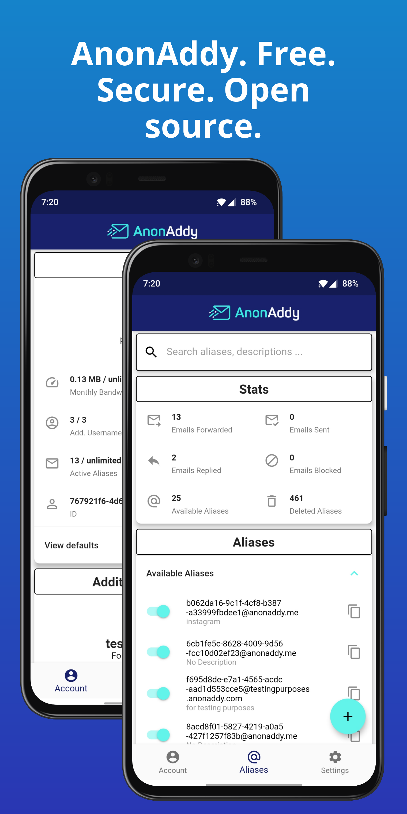
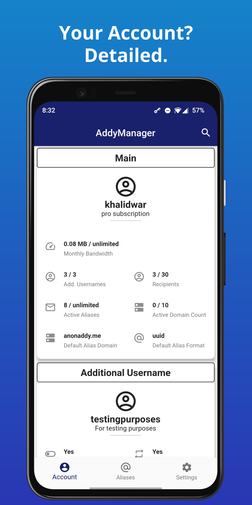
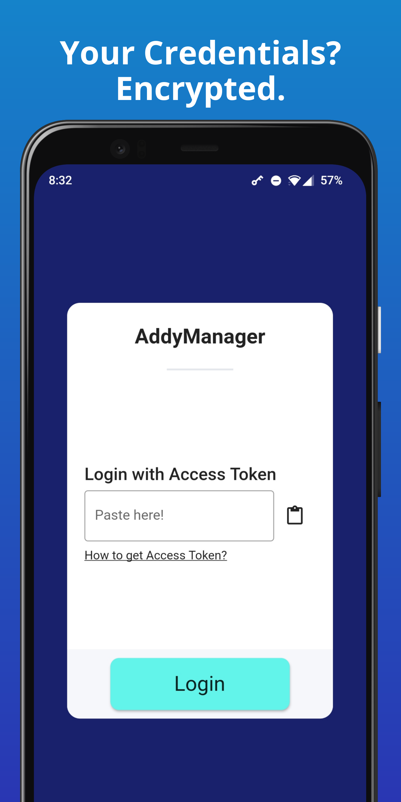
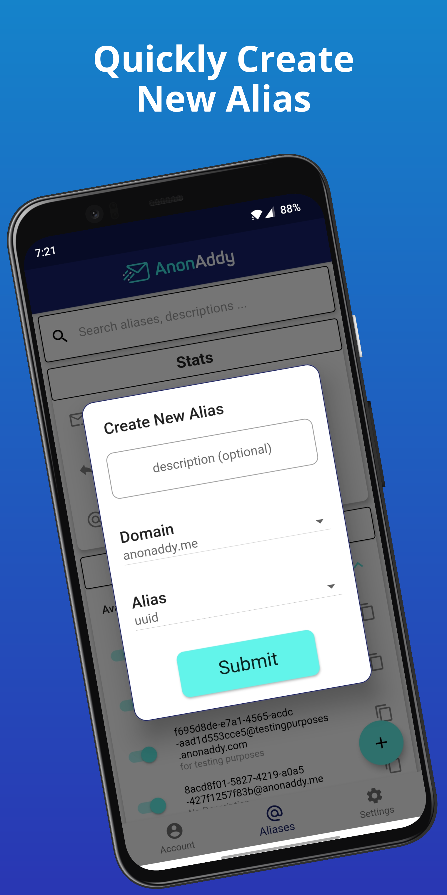
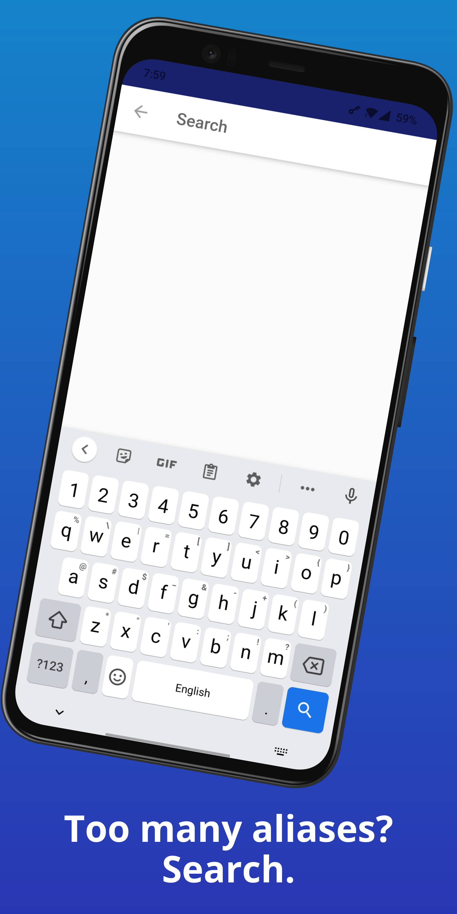

# AnonAddy
Mobile app for [AnonAddy](https://anonaddy.com/). This app utilises [AnonAddy's API](https://app.anonaddy.com/docs/) to interact with user account.

## Get it on

## Screenshots
     

## Features
- Log in with [Access Token](https://app.anonaddy.com/settings).
- Get AnonAddy account details including additional usernames.
- Get detailed view of all aliases, available and deleted ones.
- Create new alias with custom description, domain, and format (UUID and random words).
- Search aliases by email address, alias id, or description.
- Copy alias email address with a single tap.
- Activate and deactivate aliases on the fly.
- Delete and restore aliases.
- Adaptive and persistive Light and Dark themes.

## Security
App requires [Access Token](https://app.anonaddy.com/settings) to access and manage your AnonAddy account. 
This app uses secure storage, [Keychain](https://developer.apple.com/documentation/security/keychain_services#//apple_ref/doc/uid/TP30000897-CH203-TP1) for iOS and [KeyStore](https://developer.android.com/training/articles/keystore) for Android, to safely and securely store provided access token. Your access token is NEVER sent to me or any external server. 

## Privacy
This app is a one of [Khalid War's](https://github.com/KhalidWar) personal projects. It's free and open source licensed under [MIT](https://github.com/KhalidWar/anonaddy/blob/master/LICENSE). Free as in free of charge, ads, analytics, and trackers. What's yours is yours. Please feel free to inspect the code and verify for yourself.

## Packages used
- [http](https://pub.dev/packages/http)
- [Provider](https://pub.dev/packages/provider)
- [Shared Preference](https://pub.dev/packages/shared_preferences)
- [Flutter SVG](https://pub.dev/packages/flutter_svg)
- [Font Awesome Flutter](https://pub.dev/packages/font_awesome_flutter)
- [URL Launcher](https://pub.dev/packages/url_launcher)
- [Clipboard](https://pub.dev/packages/clipboard)
- [Lottie](https://pub.dev/packages/lottie)
- [Flutter Secure Storage](https://pub.dev/packages/flutter_secure_storage)
- [FlutterToast](https://pub.dev/packages/fluttertoast)

## Installation
Install by either sideloading attacked [APK file](https://github.com/KhalidWar/anonaddy/releases) on your android device or by building project from source following steps below.

### Getting Started
Check out [Flutter's official guide](https://flutter.dev/docs/get-started/install) to installing and running flutter.

### Prerequisites
- Download IDE either [Android Studio](https://developer.android.com/studio) or [VSC](https://code.visualstudio.com/)
- Install Flutter SDK and Dart plugin
- Mobile device (emulator or physical).

### Steps
- Clone this repo to your machine: `https://github.com/KhalidWar/anonaddy.git`
- Create AnonAddy account and generate your own [API Access Token](https://app.anonaddy.com/settings), found under API section.
- Install App on Emulator or physical device.
- Sign in with API Access Token.
- All set!

## License
This project is licensed under [MIT Licnese](https://github.com/KhalidWar/anonaddy/blob/master/LICENSE).

## Acknowledgement
- Special thanks to AnonAddy's team for providing us with their [API and excellent documentation](https://app.anonaddy.com/docs/).

## Disclaimer
This is a personal project and is **NOT** associated with [AnonAddy's project or team](https://github.com/anonaddy).
