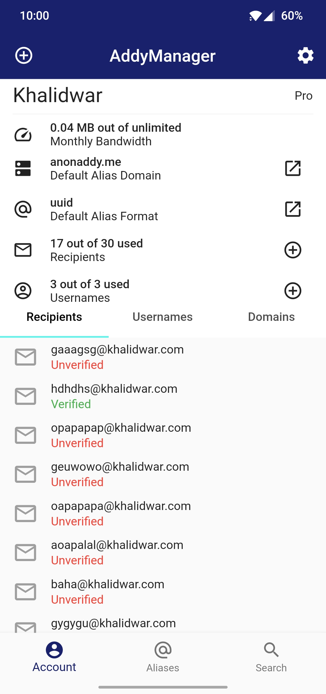
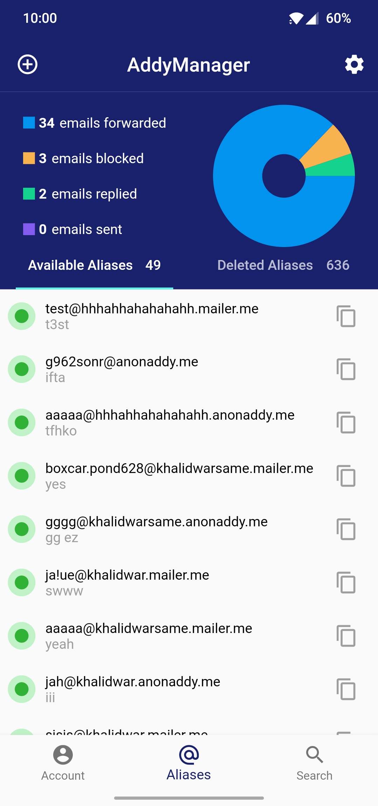

# AddyManager - addy.io for Android and iPhone.

Mobile app for [addy.io (AnonAddy)](https://addy.io/). This app
utilises [addy.io's API](https://app.addy.io/docs/) to interact with user account.

## Get it on

  

## Support AddyManager

Your support will help the continuous development of this project. Click on QR codes to get
copy-able wallet address.

## Screenshots

   

## Features

- Get detailed view of all aliases (available or deleted).
- Copy alias email with a single tap.
- Search aliases by email address, domain, alias, or description.
- Activate and deactivate aliases on the fly.
- Create new alias with custom description, domain, and format (UUID and random words).
- Delete and restore aliases.
- Add or remove PGP key.
- Enable or disable PGP Email encryption.
- Adaptive and persistent Light and Dark themes.
- Offline support: access your data even if you're in an airplane.

## Security

AddyManager requires [Access Token](https://app.addy.io/settings/api) to access and manage your
addy.io account. It utilizes secure
storage, [Keychain](https://developer.apple.com/documentation/security/keychain_services#//apple_ref/doc/uid/TP30000897-CH203-TP1)
for iOS and [KeyStore](https://developer.android.com/training/articles/keystore) for Android, to
safely and securely store provided access token.

Your access token is NOT sent to us or any third party server. However, access token is required to
interact with your addy.io account and is used to fetch aliases, recipients, domains...etc.

## Privacy

AddyManager is free and open source software licensed
under [MIT](https://github.com/KhalidWar/anonaddy/blob/master/LICENSE). Free as in free of ads,
analytics, and trackers. What's yours is yours.

Your account data, aliases, recipients, domains, search history...etc. do NOT leave your device and
are DELETED upon log out. Again, what's yours is yours.

## Packages used

Please refer to [pubspec.yaml](https://github.com/KhalidWar/anonaddy/blob/master/pubspec.yaml) for
all packages used in this project.

## Development

### Contribution

You can contribute by reporting bugs, suggesting improvements, and/or by helping out in code.
UI/UX designers are always welcome. You can email directly at addymanager@khalidwar.com.

1. Feel free to fork this repo and help out
2. Make small, concise, and well documented commits.
3. No idea where to start? Contact me and I will assign you appropriate tasks.

### Getting Started

Check out [Flutter's official guide](https://flutter.dev/docs/get-started/install) to installing and
running Flutter on your system.

### Prerequisites

- Download IDE either [Android Studio](https://developer.android.com/studio)
  or [VSC](https://code.visualstudio.com/)
- Install Flutter SDK and Dart plugin.
- Flutter stable channel is used for development.
- Mobile device (emulator or physical).

### Steps

- Clone this repo to your local machine: `git clone https://github.com/KhalidWar/anonaddy.git`
- Run `flutter run pub get` in terminal inside project root directory.
- Run `main.dart` on emulator or physical device.
- Create addy.io account and generate your own [API Access Token](https://app.addy.io/settings/api),
  found under API section.
- Sign in with your API Access Token.
- All set!

---

#### License

This project is licensed
under [MIT License](https://github.com/KhalidWar/anonaddy/blob/master/LICENSE). It means you're free
to use, copy, modify, merge, publish, distribute, sublicense, and/or sell this project.

#### Acknowledgement

Special thanks to addy.io's team for providing us with their free and well
documented [API](https://app.addy.io/docs/).

#### Disclaimer

AddyManager is independently created by [Khalid War](https://github.com/khalidwar) as a tool to help
you manage your addy.io account and is not associated with the official addy.io project or team.
